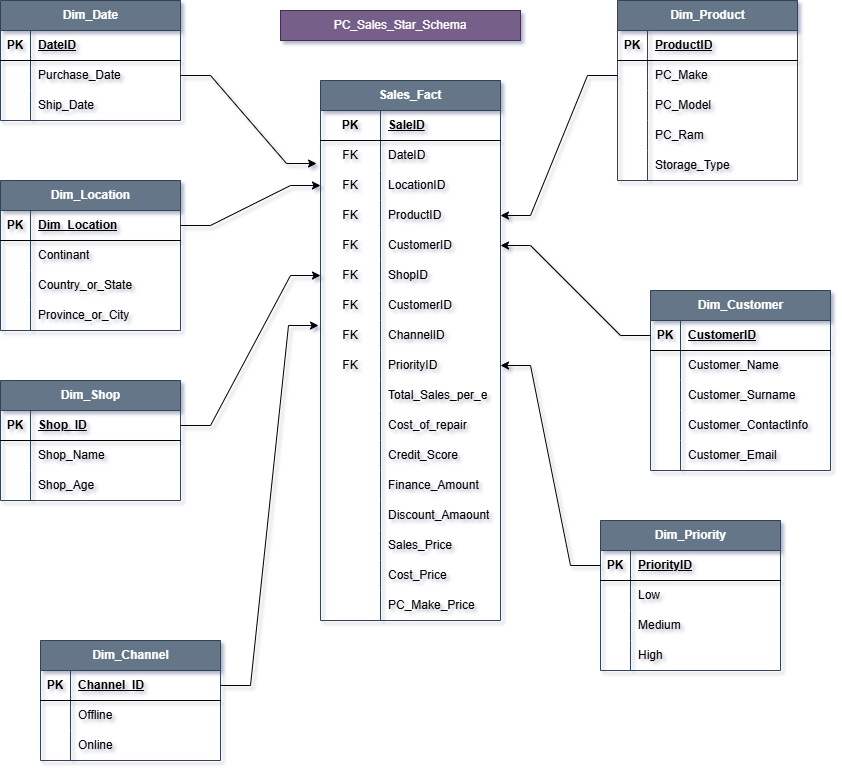

# PC Sales - Star Schema Data Warehouse

A clean **star schema** data warehouse designed for a PC company operating between **Africa** and **North America**.

## 🛠️ Tools Used

## 📋 Project Description

This project transforms raw PC sales data (`pc_data.csv`) into a well-structured **star schema** for fast business analytics and reporting.

The model includes **1 Fact Table** and **7 Dimension Tables**, optimized for OLAP queries.

## 🏗️ Star Schema Architecture

### Dimension Tables
- `dim_date`
- `dim_customer`
- `dim_location`
- `dim_channel`
- `dim_priority`
- `dim_product`
- `dim_shop`

### Fact Table
- `fact_pc_sales`

## 📁 Quick Shortcuts

Click any link below to open the file directly:

- 📊 **Data Architecture Diagram** → [View data_architecture.png](data_architecture.png)
- 📄 **README** → [View README.md](README.md)
- 🗄️ **Create Dimension Tables** → [creating_dim_tables.sql](creating_dim_tables.sql)
- 📈 **Create Fact Table** → [fact_pc_sales.sql](fact_pc_sales.sql)
- 📥 **Insert Sample Data** → [inserting_into.sql](inserting_into.sql)
- 📋 **Source Dataset** → [pc_data.csv](pc_data.csv)

> **Tip**: To quickly open the PNG diagram, just click the link above or the image at the top of this page.

## 📁 Full Repository Files

- `creating_dim_tables.sql`
- `fact_pc_sales.sql`
- `inserting_into.sql`
- `pc_data.csv`
- `data_architecture.png`
- `pc_data_exellmodeling.et`

